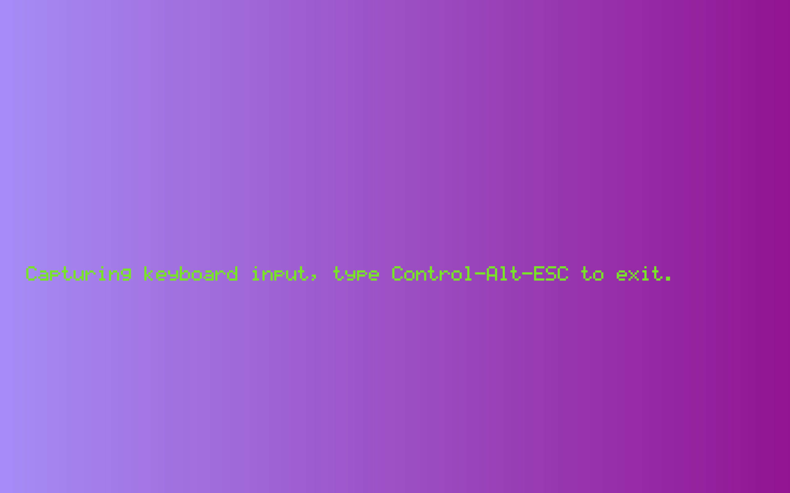

<h1 align="center">Kbdstage</h1>
<h3 align="center">一个 Linux 键盘输入拦截器，清理键盘时用</h3>

<!-- File: README.md -->
<!-- Author: YJ -->
<!-- Email: yj1516268@outlook.com -->
<!-- Created Time: 2023-07-14 15:17:53 -->

---

<p align="center">
  <a href="https://github.com/YHYJ/kbdstage/actions/workflows/release.yml"></a>
</p>

---

## Table of Contents

<!-- vim-markdown-toc GFM -->

* [适配](#适配)
* [安装](#安装)
  * [一键安装](#一键安装)
  * [编译安装](#编译安装)
    * [当前平台](#当前平台)
    * [交叉编译](#交叉编译)
* [用法](#用法)
* [截图](#截图)

<!-- vim-markdown-toc -->

---

<!------------------------------------------------>
<!--  _    _         _     _                    -->
<!-- | | _| |__   __| |___| |_ __ _  __ _  ___  -->
<!-- | |/ / '_ \ / _` / __| __/ _` |/ _` |/ _ \ -->
<!-- |   <| |_) | (_| \__ \ || (_| | (_| |  __/ -->
<!-- |_|\_\_.__/ \__,_|___/\__\__,_|\__, |\___| -->
<!--                                |___/       -->
<!------------------------------------------------>

---

## 适配

- Linux: 适配（需要 X Server 或 XWayland）
- macOS: 不适配
- Windows: 不适配

## 安装

### 一键安装

```bash
curl -fsSL https://raw.githubusercontent.com/YHYJ/kbdstage/main/install.sh | sudo bash -s
```

也可以从 [GitHub Releases](https://github.com/YHYJ/kbdstage/releases) 下载解压后使用

### 编译安装

#### 当前平台

如果要为当前平台编译，可以使用以下命令：

```bash
go build -gcflags="-trimpath" -ldflags="-s -w -X github.com/yhyj/kbdstage/general.GitCommitHash=`git rev-parse HEAD` -X github.com/yhyj/kbdstage/general.BuildTime=`date +%s` -X github.com/yhyj/kbdstage/general.BuildBy=$USER" -o build/kbdstage main.go
```

#### 交叉编译

> 使用命令`go tool dist list`查看支持的平台
>
> Linux 和 macOS 使用命令`uname -m`，Windows 使用命令`echo %PROCESSOR_ARCHITECTURE%` 确认系统架构
>
> - 例如 x86_64 则设 GOARCH=amd64
> - 例如 aarch64 则设 GOARCH=arm64
> - ...

设置如下系统变量后使用 [编译安装](#编译安装) 的命令即可进行交叉编译：

- CGO_ENABLED: 不使用 CGO，设为 0
- GOOS: 设为 linux
- GOARCH: 根据当前系统架构设置

## 用法

- `start`子命令

  开始拦截键盘输入

- `version`子命令

  查看程序版本信息

- `help`子命令

  查看程序帮助信息

## 截图


